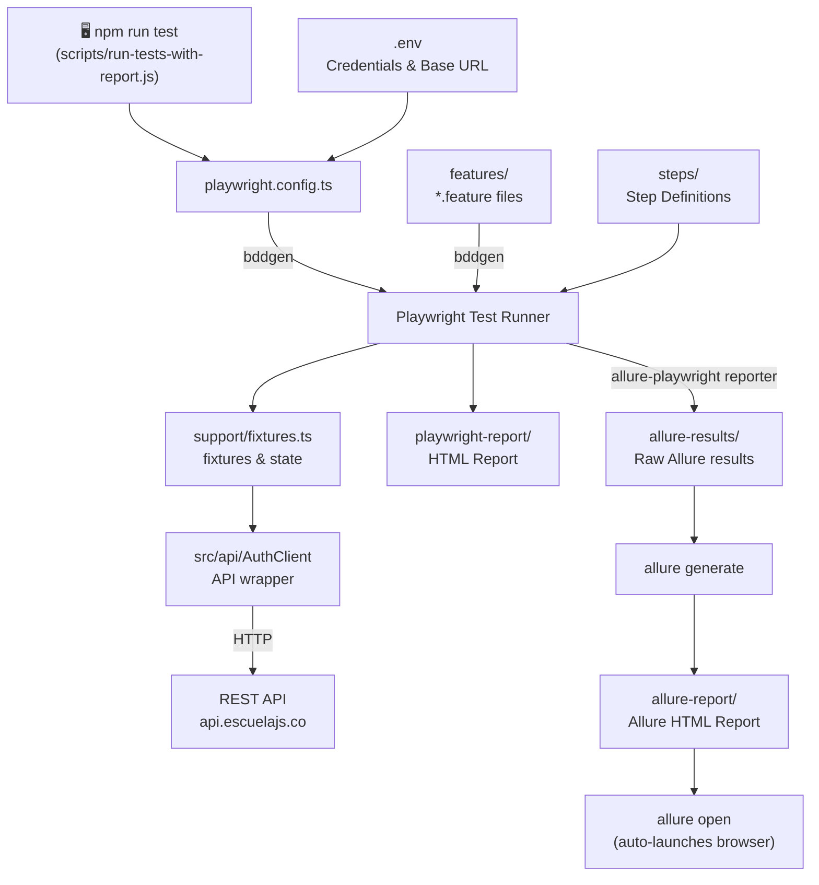

# Framework Architecture

---

| Layer | Path | Role |
|---|---|---|
| Config | `playwright.config.ts` | Base URL, retries, reporters (incl. `allure-playwright`), BDD globs |
| BDD Scenarios | `features/` | Gherkin feature files (`@smoke`, `@regression`) |
| Step Definitions | `steps/` | Given / When / Then bindings |
| Fixtures | `support/fixtures.ts` | `authClient` + per-test `authState` |
| API Client | `src/api/` | Typed wrappers for each endpoint |
| Report (Playwright) | `playwright-report/` | HTML output after each run (not auto-opened) |
| Report (Allure results) | `allure-results/` | Raw JSON results written by the `allure-playwright` reporter during the run |
| Report (Allure HTML) | `allure-report/` | Static HTML report built from `allure-results/` via `allure generate` |
| Report (Allure launch) | `npm run allure:open` | Serves `allure-report/` and opens it in the default browser — chained automatically after every `npm test` run |
| Orchestration | `scripts/run-tests-with-report.js` | Cross-platform Node runner: runs Playwright, then always runs `allure generate`/`allure open`, then exits with the tests' real exit code |
